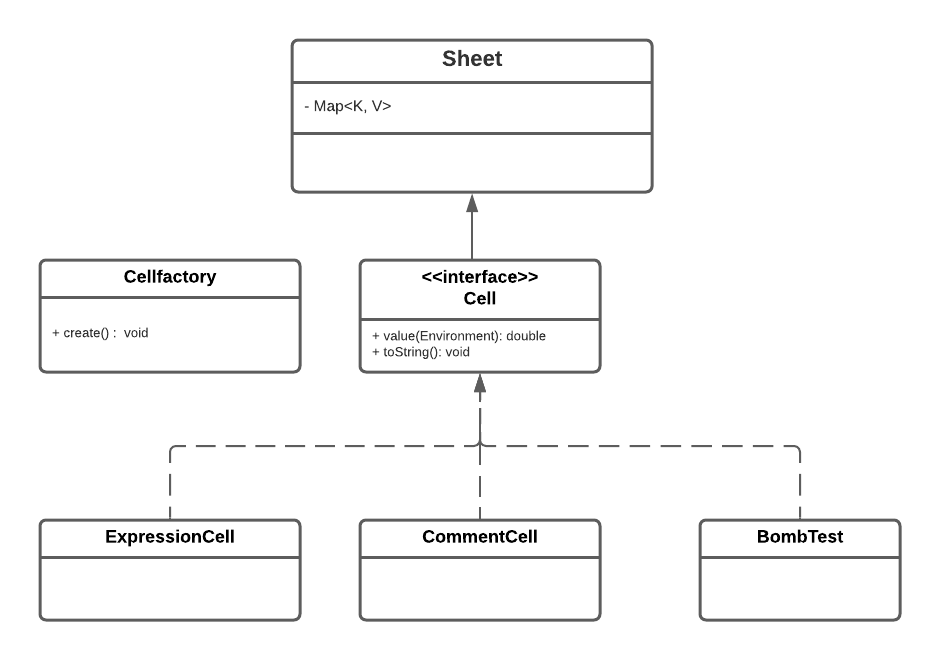

# EDAF60 - XL

# EDAF60 - group 2: XL

+ Jacob Persson
+ Nova Svensson
+ Katia Svennarp
+ Annie Börjesson

## Answers to design questions

+ **A3**:
SlotLabel is the white box that is in the grid.
SlotLabels adds the white box to the whole grid.
Editor sets the background to the editor field, that’s the field where you put in a string.
StatusLabel changes the input of the label.
CurrentLabel handles the label in which you are changing input.
XL sets up the program and the GUI and then runs the program.

+ **A4**: 
The view notifies the controller that the user has written something in the editor. The controller then sends an address and a value to the model. The model calculates the new value (if it’s an expression) and tells the controller when it’s done. The controller then tells the view to get the new value from the model and update the whole window.

+ **B2**:
A common interface that we will call cell, which is implemented by three classes; ExpressionCell which has an expression and CommentCell which has a comment. The cell-interface will be in the model. BombTest will also implement cell, and the purpose is to look for circular dependencies. 

+ **B4**: 
Interface Cell, ExpressionCell, CommentCell, Sheet, BombTest. 

+ **C1**: 
Environment is used to get the values from the matrix. It will take an address and the return a value. If the address refer a empty cell it will return zero.

+ **D1**:
Our GUI needs to know about the sheet class, which is the class that handles all the cells. 

+ **D2**: 
We want to get the calcualted value as a string back.

+ **E4**:
A possible error will get caught in the model.

+ **E5**: 
In the model package. The model will fix errors by resetting the value if something goes wrong. First, the model will save the current value in the cell. If an error occurs, the model will go back to the old value. The view won't be updated until the model sends a new value. 

+ **F1**:
We will use Flow Synchronization. Which means we will have a separate controller-class who listenes to the view and the model.

+ **F2**: 
As we will use flow synchronization the view will inform the controller about the current cell. 

+ **F3**:
Updates are triggered by the controller that tells the view to get at new value from the model and update the window.

## To run the program

~~~{.sh}
./gradlew run
or
gradle.bat run
~~~
